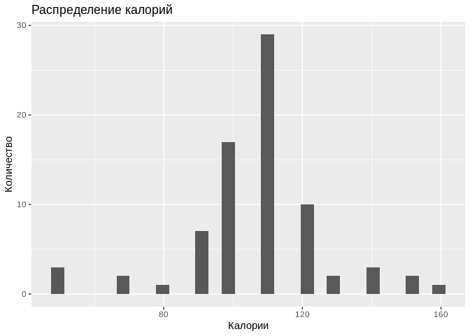
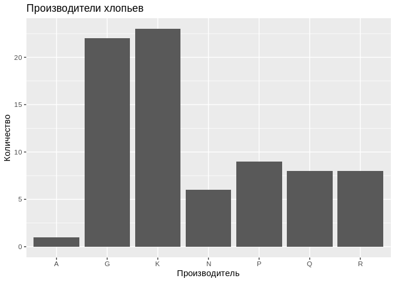
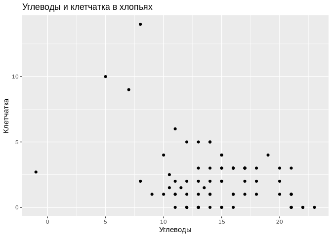

Домашнее задание можно выполнять на данных с которымии вы работаете :)
Если таких нет, то можно использовать данные про хлопья для завтрака `cereal.csv`.

Описание данных:

- Name - название производителя хлопьев

- mfr - название производителя

- type - тип хлопьев

- protein - белки, в гм на порцию

- fat - жиры в гм  на порцию

- sodium - натрий в мг на порцию

- fiber - клетчатка в гм на порцию

- carbo - углеводы в гм на порцию

- sugars - сахар в гм на порцию
 
- potass - калий в мг на порцию

- vitamins - витамины и минералы

- shelf - полка, на которой хлопья стоят в магазине, считая от пола

- weight - вес одной порции в унциях 

- cups - число чашек в порции

- rating - оценка хлопьев покупателями

1. Подключите библиотеки `tidyverse`, `rio`, `skimr`.


```r
library(tidyverse)
```

```
## ── Attaching packages ────────────────────────────────────────────────────────────────────── tidyverse 1.2.1 ──
```

```
## ✔ ggplot2 2.2.1.9000     ✔ purrr   0.2.4     
## ✔ tibble  1.4.2          ✔ dplyr   0.7.5     
## ✔ tidyr   0.8.1          ✔ stringr 1.3.1     
## ✔ readr   1.1.1          ✔ forcats 0.3.0
```

```
## ── Conflicts ───────────────────────────────────────────────────────────────────────── tidyverse_conflicts() ──
## ✖ dplyr::filter() masks stats::filter()
## ✖ dplyr::lag()    masks stats::lag()
```

```r
library(rio)
library(skimr)
```


2. Загрузите данные из файла `cereal.csv` (или из вашего файла) и
сохраните их в переменной под названием `df`.
Для этого нужно воспользоваться функцией `import` из пакета `rio`.
Проверьте, что данные загрузились с помощью команд `glimpse`, `head` и `tail`.


```r
df <- import('cereal.csv')
glimpse(df)
```

```
## Observations: 77
## Variables: 16
## $ name     <chr> "100% Bran", "100% Natural Bran", "All-Bran", "All-Br...
## $ mfr      <chr> "N", "Q", "K", "K", "R", "G", "K", "G", "R", "P", "Q"...
## $ type     <chr> "C", "C", "C", "C", "C", "C", "C", "C", "C", "C", "C"...
## $ calories <int> 70, 120, 70, 50, 110, 110, 110, 130, 90, 90, 120, 110...
## $ protein  <int> 4, 3, 4, 4, 2, 2, 2, 3, 2, 3, 1, 6, 1, 3, 1, 2, 2, 1,...
## $ fat      <int> 1, 5, 1, 0, 2, 2, 0, 2, 1, 0, 2, 2, 3, 2, 1, 0, 0, 0,...
## $ sodium   <int> 130, 15, 260, 140, 200, 180, 125, 210, 200, 210, 220,...
## $ fiber    <dbl> 10.0, 2.0, 9.0, 14.0, 1.0, 1.5, 1.0, 2.0, 4.0, 5.0, 0...
## $ carbo    <dbl> 5.0, 8.0, 7.0, 8.0, 14.0, 10.5, 11.0, 18.0, 15.0, 13....
## $ sugars   <int> 6, 8, 5, 0, 8, 10, 14, 8, 6, 5, 12, 1, 9, 7, 13, 3, 2...
## $ potass   <int> 280, 135, 320, 330, -1, 70, 30, 100, 125, 190, 35, 10...
## $ vitamins <int> 25, 0, 25, 25, 25, 25, 25, 25, 25, 25, 25, 25, 25, 25...
## $ shelf    <int> 3, 3, 3, 3, 3, 1, 2, 3, 1, 3, 2, 1, 2, 3, 2, 1, 1, 2,...
## $ weight   <dbl> 1.00, 1.00, 1.00, 1.00, 1.00, 1.00, 1.00, 1.33, 1.00,...
## $ cups     <dbl> 0.33, 1.00, 0.33, 0.50, 0.75, 0.75, 1.00, 0.75, 0.67,...
## $ rating   <dbl> 68.40297, 33.98368, 59.42551, 93.70491, 34.38484, 29....
```

```r
head(df)
```

```
##                        name mfr type calories protein fat sodium fiber
## 1                 100% Bran   N    C       70       4   1    130  10.0
## 2         100% Natural Bran   Q    C      120       3   5     15   2.0
## 3                  All-Bran   K    C       70       4   1    260   9.0
## 4 All-Bran with Extra Fiber   K    C       50       4   0    140  14.0
## 5            Almond Delight   R    C      110       2   2    200   1.0
## 6   Apple Cinnamon Cheerios   G    C      110       2   2    180   1.5
##   carbo sugars potass vitamins shelf weight cups   rating
## 1   5.0      6    280       25     3      1 0.33 68.40297
## 2   8.0      8    135        0     3      1 1.00 33.98368
## 3   7.0      5    320       25     3      1 0.33 59.42551
## 4   8.0      0    330       25     3      1 0.50 93.70491
## 5  14.0      8     -1       25     3      1 0.75 34.38484
## 6  10.5     10     70       25     1      1 0.75 29.50954
```

```r
tail(df)
```

```
##                   name mfr type calories protein fat sodium fiber carbo
## 72   Total Whole Grain   G    C      100       3   1    200     3    16
## 73             Triples   G    C      110       2   1    250     0    21
## 74                Trix   G    C      110       1   1    140     0    13
## 75          Wheat Chex   R    C      100       3   1    230     3    17
## 76            Wheaties   G    C      100       3   1    200     3    17
## 77 Wheaties Honey Gold   G    C      110       2   1    200     1    16
##    sugars potass vitamins shelf weight cups   rating
## 72      3    110      100     3      1 1.00 46.65884
## 73      3     60       25     3      1 0.75 39.10617
## 74     12     25       25     2      1 1.00 27.75330
## 75      3    115       25     1      1 0.67 49.78744
## 76      3    110       25     1      1 1.00 51.59219
## 77      8     60       25     1      1 0.75 36.18756
```

3. Посмотрите на описательные статистики. 
Здесь пригодится функция `skim()` из пакета `skimr()`.


```r
skim(df)
```

```
## Skim summary statistics
##  n obs: 77 
##  n variables: 16 
## 
## Variable type: character 
##  variable missing complete  n min max empty n_unique
##       mfr       0       77 77   1   1     0        7
##      name       0       77 77   3  38     0       77
##      type       0       77 77   1   1     0        2
## 
## Variable type: integer 
##  variable missing complete  n   mean    sd p0 p25 p50 p75 p100     hist
##  calories       0       77 77 106.88 19.48 50 100 110 110  160 ▁▁▂▅▇▃▁▁
##       fat       0       77 77   1.01  1.01  0   0   1   2    5 ▇▇▁▃▁▁▁▁
##    potass       0       77 77  96.08 71.29 -1  40  90 120  330 ▇▅▇▂▂▁▁▁
##   protein       0       77 77   2.55  1.09  1   2   3   3    6 ▃▇▁▇▂▁▁▁
##     shelf       0       77 77   2.21  0.83  1   1   2   3    3 ▅▁▁▅▁▁▁▇
##    sodium       0       77 77 159.68 83.83  0 130 180 210  320 ▅▂▁▆▇▅▂▂
##    sugars       0       77 77   6.92  4.44 -1   3   7  11   15 ▅▇▃▆▅▅▆▂
##  vitamins       0       77 77  28.25 22.34  0  25  25  25  100 ▁▇▁▁▁▁▁▁
## 
## Variable type: numeric 
##  variable missing complete  n  mean    sd    p0   p25   p50   p75 p100
##     carbo       0       77 77 14.6   4.28 -1    12    14    17    23  
##      cups       0       77 77  0.82  0.23  0.25  0.67  0.75  1     1.5
##     fiber       0       77 77  2.15  2.38  0     1     2     3    14  
##    rating       0       77 77 42.67 14.05 18.04 33.17 40.4  50.83 93.7
##    weight       0       77 77  1.03  0.15  0.5   1     1     1     1.5
##      hist
##  ▁▁▁▃▇▇▂▃
##  ▁▂▃▅▇▁▁▁
##  ▇▆▂▁▁▁▁▁
##  ▂▇▇▅▂▂▁▁
##  ▁▁▁▇▁▁▁▁
```

- Сколько в выборке наблюдений? Сколько переменных? *77*, *16*

- Есть ли в данных пропущенные переменные? *Нет*

- Сколько в среднем калорий содержится в порции хлопьев? *106.88*

4. Постройте гистограммы для калорий (столбец `calories`) и для производителей (столбец `mfr`).
Не забудьте подписать оси и добавить название.
Для выполнения упражнения понадобится команда `qplot`.


```r
qplot(data = df, x = calories) +
  labs(x = 'Калории', y = 'Количество', title = 'Распределение калорий')
```

```
## `stat_bin()` using `bins = 30`. Pick better value with `binwidth`.
```

<!-- -->

```r
qplot(data = df, x = mfr) +
  labs(x = 'Производитель', y = 'Количество', title = 'Производители хлопьев')
```

<!-- -->

5. С помощью той же команды `qplot` постройте диаграмму рассеяния для переменных `carbo` (по оси абсцисс) и `fiber` (по оси ординат). Не забудьте про название графика и осей!


```r
qplot(data = df, x = carbo, y = fiber) +
  labs(x = 'Углеводы', y = 'Клетчатка', title = 'Углеводы и клетчатка в хлопьях')
```

<!-- -->

6. Выберите из данных те наблюдения, в которых сахара (`sugars`) в проции больше, чем 10 г, а белков (`protein`) — меньше, чем в средней порции. Cохраните их под названием `df_sub`. Посмотрите на описательные статистики.

```r
df_sub <- filter(df, sugars > 10, protein < mean(protein))
skim(df_sub)
```

```
## Skim summary statistics
##  n obs: 14 
##  n variables: 16 
## 
## Variable type: character 
##  variable missing complete  n min max empty n_unique
##       mfr       0       14 14   1   1     0        4
##      name       0       14 14   4  16     0       14
##      type       0       14 14   1   1     0        1
## 
## Variable type: integer 
##  variable missing complete  n   mean    sd  p0    p25 p50    p75 p100
##  calories       0       14 14 110.71  4.75 100 110    110 110     120
##       fat       0       14 14   0.79  0.7    0   0      1   1       2
##    potass       0       14 14  37.5  13.41  20  26.25  35  43.75   65
##   protein       0       14 14   1.36  0.5    1   1      1   2       2
##     shelf       0       14 14   1.79  0.43   1   2      2   2       2
##    sodium       0       14 14 149.29 54.41  45 125    160 180     220
##    sugars       0       14 14  12.57  1.34  11  12     12  13      15
##  vitamins       0       14 14  25     0     25  25     25  25      25
##      hist
##  ▁▁▁▇▁▁▁▂
##  ▆▁▁▇▁▁▁▂
##  ▇▃▃▃▂▁▃▂
##  ▇▁▁▁▁▁▁▅
##  ▂▁▁▁▁▁▁▇
##  ▂▂▂▃▃▁▇▆
##  ▅▇▁▅▁▂▁▃
##  ▁▁▁▇▁▁▁▁
## 
## Variable type: numeric 
##  variable missing complete  n  mean   sd    p0   p25   p50   p75  p100
##     carbo       0       14 14 12.07 1.33  9    11.25 12    13    14   
##      cups       0       14 14  0.94 0.16  0.75  0.78  1     1     1.33
##     fiber       0       14 14  0.43 0.51  0     0     0     1     1   
##    rating       0       14 14 28.24 5.39 18.04 23.74 28.38 32.01 35.78
##    weight       0       14 14  1    0     1     1     1     1     1   
##      hist
##  ▂▁▁▅▇▁▅▃
##  ▃▁▁▇▁▁▁▁
##  ▇▁▁▁▁▁▁▆
##  ▂▅▂▂▇▂▇▅
##  ▁▁▁▇▁▁▁▁
```

- Сколько в среднем клетчатки в отобранных данных? *0.43*

7. Добавьте в исходные данные `df` столбец `weight_g` с весом пачки хлопьев в граммах.
Вам понадобится функция `mutate`. В одной унции приблизительно 28 грамм :)


```r
df <- mutate(df, weight_g = weight * 28)
skim(df)
```

```
## Skim summary statistics
##  n obs: 77 
##  n variables: 17 
## 
## Variable type: character 
##  variable missing complete  n min max empty n_unique
##       mfr       0       77 77   1   1     0        7
##      name       0       77 77   3  38     0       77
##      type       0       77 77   1   1     0        2
## 
## Variable type: integer 
##  variable missing complete  n   mean    sd p0 p25 p50 p75 p100     hist
##  calories       0       77 77 106.88 19.48 50 100 110 110  160 ▁▁▂▅▇▃▁▁
##       fat       0       77 77   1.01  1.01  0   0   1   2    5 ▇▇▁▃▁▁▁▁
##    potass       0       77 77  96.08 71.29 -1  40  90 120  330 ▇▅▇▂▂▁▁▁
##   protein       0       77 77   2.55  1.09  1   2   3   3    6 ▃▇▁▇▂▁▁▁
##     shelf       0       77 77   2.21  0.83  1   1   2   3    3 ▅▁▁▅▁▁▁▇
##    sodium       0       77 77 159.68 83.83  0 130 180 210  320 ▅▂▁▆▇▅▂▂
##    sugars       0       77 77   6.92  4.44 -1   3   7  11   15 ▅▇▃▆▅▅▆▂
##  vitamins       0       77 77  28.25 22.34  0  25  25  25  100 ▁▇▁▁▁▁▁▁
## 
## Variable type: numeric 
##  variable missing complete  n  mean    sd    p0   p25   p50   p75 p100
##     carbo       0       77 77 14.6   4.28 -1    12    14    17    23  
##      cups       0       77 77  0.82  0.23  0.25  0.67  0.75  1     1.5
##     fiber       0       77 77  2.15  2.38  0     1     2     3    14  
##    rating       0       77 77 42.67 14.05 18.04 33.17 40.4  50.83 93.7
##    weight       0       77 77  1.03  0.15  0.5   1     1     1     1.5
##  weight_g       0       77 77 28.83  4.21 14    28    28    28    42  
##      hist
##  ▁▁▁▃▇▇▂▃
##  ▁▂▃▅▇▁▁▁
##  ▇▆▂▁▁▁▁▁
##  ▂▇▇▅▂▂▁▁
##  ▁▁▁▇▁▁▁▁
##  ▁▁▁▇▁▁▁▁
```
Какой средний вес порции хлопьев в граммах? *28.83*


8. Отсортируйте исходные данные `df` по рейтингу покупателей с помощью функции `arrange`, сохраните результат в переменной `sorted` и посмотрите на её содержимое.


```r
sorted <- arrange(df, rating)
sorted
```

```
##                                      name mfr type calories protein fat
## 1                            Cap'n'Crunch   Q    C      120       1   2
## 2                   Cinnamon Toast Crunch   G    C      120       1   3
## 3                        Honey Graham Ohs   Q    C      120       1   2
## 4                           Count Chocula   G    C      110       1   1
## 5                             Cocoa Puffs   G    C      110       1   1
## 6                          Golden Grahams   G    C      110       1   1
## 7                            Lucky Charms   G    C      110       2   1
## 8                                    Trix   G    C      110       1   1
## 9                          Fruity Pebbles   P    C      110       1   1
## 10                      Total Raisin Bran   G    C      140       3   1
## 11                             Honey-comb   P    C      110       1   0
## 12                Apple Cinnamon Cheerios   G    C      110       2   2
## 13                       Nut&Honey Crunch   K    C      120       2   1
## 14                   Mueslix Crispy Blend   K    C      160       3   2
## 15                   Oatmeal Raisin Crisp   G    C      130       3   2
## 16                     Honey Nut Cheerios   G    C      110       3   1
## 17                                 Smacks   K    C      110       2   1
## 18                         Frosted Flakes   K    C      110       1   0
## 19                            Froot Loops   K    C      110       2   1
## 20                            Apple Jacks   K    C      110       2   0
## 21                      100% Natural Bran   Q    C      120       3   5
## 22      Muesli Raisins; Peaches; & Pecans   R    C      150       4   3
## 23                         Almond Delight   R    C      110       2   2
## 24                           Golden Crisp   P    C      100       2   0
## 25                              Corn Pops   K    C      110       1   0
## 26                 Crispy Wheat & Raisins   G    C      100       2   1
## 27                    Wheaties Honey Gold   G    C      110       2   1
## 28                 Just Right Fruit & Nut   K    C      140       3   1
## 29            Just Right Crunchy  Nuggets   K    C      110       2   1
## 30                                Basic 4   G    C      130       3   2
## 31       Muesli Raisins; Dates; & Almonds   R    C      150       4   3
## 32                  Post Nat. Raisin Bran   P    C      120       3   1
## 33                      Total Corn Flakes   G    C      110       2   1
## 34                                Triples   G    C      110       2   1
## 35                                    Kix   G    C      110       2   1
## 36                            Raisin Bran   K    C      120       3   1
## 37                        Raisin Nut Bran   G    C      100       3   2
## 38                   Multi-Grain Cheerios   G    C      100       2   1
## 39                               Clusters   G    C      110       3   2
## 40                     Cracklin' Oat Bran   K    C      110       3   3
## 41                          Rice Krispies   K    C      110       2   0
## 42              Nutri-Grain Almond-Raisin   K    C      140       3   2
## 43 Fruit & Fibre Dates; Walnuts; and Oats   P    C      120       3   2
## 44                          Fruitful Bran   K    C      120       3   0
## 45                              Corn Chex   R    C      110       2   0
## 46                             Product 19   K    C      100       3   0
## 47                              Rice Chex   R    C      110       1   0
## 48                            Double Chex   R    C      100       2   0
## 49                                   Life   Q    C      100       4   2
## 50                     Great Grains Pecan   P    C      120       3   3
## 51                            Corn Flakes   K    C      100       2   0
## 52                      Total Whole Grain   G    C      100       3   1
## 53                                Crispix   K    C      110       2   0
## 54                              Bran Chex   R    C       90       2   1
## 55                     Quaker Oat Squares   Q    C      100       4   1
## 56                             Wheat Chex   R    C      100       3   1
## 57                               Cheerios   G    C      110       6   2
## 58                         Quaker Oatmeal   Q    H      100       5   2
## 59                               Wheaties   G    C      100       3   1
## 60                      Grape Nuts Flakes   P    C      100       3   1
## 61                              Special K   K    C      110       6   0
## 62                            Bran Flakes   P    C       90       3   0
## 63                             Grape-Nuts   P    C      110       3   0
## 64                                  Maypo   A    H      100       4   1
## 65                         Raisin Squares   K    C       90       2   0
## 66                    Frosted Mini-Wheats   K    C      100       3   0
## 67                Strawberry Fruit Wheats   N    C       90       2   0
## 68                               All-Bran   K    C       70       4   1
## 69                      Nutri-grain Wheat   K    C       90       3   0
## 70                            Puffed Rice   Q    C       50       1   0
## 71                           Puffed Wheat   Q    C       50       2   0
## 72                 Cream of Wheat (Quick)   N    H      100       3   0
## 73                         Shredded Wheat   N    C       80       2   0
## 74                              100% Bran   N    C       70       4   1
## 75              Shredded Wheat spoon size   N    C       90       3   0
## 76                 Shredded Wheat 'n'Bran   N    C       90       3   0
## 77              All-Bran with Extra Fiber   K    C       50       4   0
##    sodium fiber carbo sugars potass vitamins shelf weight cups   rating
## 1     220   0.0  12.0     12     35       25     2   1.00 0.75 18.04285
## 2     210   0.0  13.0      9     45       25     2   1.00 0.75 19.82357
## 3     220   1.0  12.0     11     45       25     2   1.00 1.00 21.87129
## 4     180   0.0  12.0     13     65       25     2   1.00 1.00 22.39651
## 5     180   0.0  12.0     13     55       25     2   1.00 1.00 22.73645
## 6     280   0.0  15.0      9     45       25     2   1.00 0.75 23.80404
## 7     180   0.0  12.0     12     55       25     2   1.00 1.00 26.73451
## 8     140   0.0  13.0     12     25       25     2   1.00 1.00 27.75330
## 9     135   0.0  13.0     12     25       25     2   1.00 0.75 28.02576
## 10    190   4.0  15.0     14    230      100     3   1.50 1.00 28.59278
## 11    180   0.0  14.0     11     35       25     1   1.00 1.33 28.74241
## 12    180   1.5  10.5     10     70       25     1   1.00 0.75 29.50954
## 13    190   0.0  15.0      9     40       25     2   1.00 0.67 29.92429
## 14    150   3.0  17.0     13    160       25     3   1.50 0.67 30.31335
## 15    170   1.5  13.5     10    120       25     3   1.25 0.50 30.45084
## 16    250   1.5  11.5     10     90       25     1   1.00 0.75 31.07222
## 17     70   1.0   9.0     15     40       25     2   1.00 0.75 31.23005
## 18    200   1.0  14.0     11     25       25     1   1.00 0.75 31.43597
## 19    125   1.0  11.0     13     30       25     2   1.00 1.00 32.20758
## 20    125   1.0  11.0     14     30       25     2   1.00 1.00 33.17409
## 21     15   2.0   8.0      8    135        0     3   1.00 1.00 33.98368
## 22    150   3.0  16.0     11    170       25     3   1.00 1.00 34.13976
## 23    200   1.0  14.0      8     -1       25     3   1.00 0.75 34.38484
## 24     45   0.0  11.0     15     40       25     1   1.00 0.88 35.25244
## 25     90   1.0  13.0     12     20       25     2   1.00 1.00 35.78279
## 26    140   2.0  11.0     10    120       25     3   1.00 0.75 36.17620
## 27    200   1.0  16.0      8     60       25     1   1.00 0.75 36.18756
## 28    170   2.0  20.0      9     95      100     3   1.30 0.75 36.47151
## 29    170   1.0  17.0      6     60      100     3   1.00 1.00 36.52368
## 30    210   2.0  18.0      8    100       25     3   1.33 0.75 37.03856
## 31     95   3.0  16.0     11    170       25     3   1.00 1.00 37.13686
## 32    200   6.0  11.0     14    260       25     3   1.33 0.67 37.84059
## 33    200   0.0  21.0      3     35      100     3   1.00 1.00 38.83975
## 34    250   0.0  21.0      3     60       25     3   1.00 0.75 39.10617
## 35    260   0.0  21.0      3     40       25     2   1.00 1.50 39.24111
## 36    210   5.0  14.0     12    240       25     2   1.33 0.75 39.25920
## 37    140   2.5  10.5      8    140       25     3   1.00 0.50 39.70340
## 38    220   2.0  15.0      6     90       25     1   1.00 1.00 40.10596
## 39    140   2.0  13.0      7    105       25     3   1.00 0.50 40.40021
## 40    140   4.0  10.0      7    160       25     3   1.00 0.50 40.44877
## 41    290   0.0  22.0      3     35       25     1   1.00 1.00 40.56016
## 42    220   3.0  21.0      7    130       25     3   1.33 0.67 40.69232
## 43    160   5.0  12.0     10    200       25     3   1.25 0.67 40.91705
## 44    240   5.0  14.0     12    190       25     3   1.33 0.67 41.01549
## 45    280   0.0  22.0      3     25       25     1   1.00 1.00 41.44502
## 46    320   1.0  20.0      3     45      100     3   1.00 1.00 41.50354
## 47    240   0.0  23.0      2     30       25     1   1.00 1.13 41.99893
## 48    190   1.0  18.0      5     80       25     3   1.00 0.75 44.33086
## 49    150   2.0  12.0      6     95       25     2   1.00 0.67 45.32807
## 50     75   3.0  13.0      4    100       25     3   1.00 0.33 45.81172
## 51    290   1.0  21.0      2     35       25     1   1.00 1.00 45.86332
## 52    200   3.0  16.0      3    110      100     3   1.00 1.00 46.65884
## 53    220   1.0  21.0      3     30       25     3   1.00 1.00 46.89564
## 54    200   4.0  15.0      6    125       25     1   1.00 0.67 49.12025
## 55    135   2.0  14.0      6    110       25     3   1.00 0.50 49.51187
## 56    230   3.0  17.0      3    115       25     1   1.00 0.67 49.78744
## 57    290   2.0  17.0      1    105       25     1   1.00 1.25 50.76500
## 58      0   2.7  -1.0     -1    110        0     1   1.00 0.67 50.82839
## 59    200   3.0  17.0      3    110       25     1   1.00 1.00 51.59219
## 60    140   3.0  15.0      5     85       25     3   1.00 0.88 52.07690
## 61    230   1.0  16.0      3     55       25     1   1.00 1.00 53.13132
## 62    210   5.0  13.0      5    190       25     3   1.00 0.67 53.31381
## 63    170   3.0  17.0      3     90       25     3   1.00 0.25 53.37101
## 64      0   0.0  16.0      3     95       25     2   1.00 1.00 54.85092
## 65      0   2.0  15.0      6    110       25     3   1.00 0.50 55.33314
## 66      0   3.0  14.0      7    100       25     2   1.00 0.80 58.34514
## 67     15   3.0  15.0      5     90       25     2   1.00 1.00 59.36399
## 68    260   9.0   7.0      5    320       25     3   1.00 0.33 59.42551
## 69    170   3.0  18.0      2     90       25     3   1.00 1.00 59.64284
## 70      0   0.0  13.0      0     15        0     3   0.50 1.00 60.75611
## 71      0   1.0  10.0      0     50        0     3   0.50 1.00 63.00565
## 72     80   1.0  21.0      0     -1        0     2   1.00 1.00 64.53382
## 73      0   3.0  16.0      0     95        0     1   0.83 1.00 68.23588
## 74    130  10.0   5.0      6    280       25     3   1.00 0.33 68.40297
## 75      0   3.0  20.0      0    120        0     1   1.00 0.67 72.80179
## 76      0   4.0  19.0      0    140        0     1   1.00 0.67 74.47295
## 77    140  14.0   8.0      0    330       25     3   1.00 0.50 93.70491
##    weight_g
## 1     28.00
## 2     28.00
## 3     28.00
## 4     28.00
## 5     28.00
## 6     28.00
## 7     28.00
## 8     28.00
## 9     28.00
## 10    42.00
## 11    28.00
## 12    28.00
## 13    28.00
## 14    42.00
## 15    35.00
## 16    28.00
## 17    28.00
## 18    28.00
## 19    28.00
## 20    28.00
## 21    28.00
## 22    28.00
## 23    28.00
## 24    28.00
## 25    28.00
## 26    28.00
## 27    28.00
## 28    36.40
## 29    28.00
## 30    37.24
## 31    28.00
## 32    37.24
## 33    28.00
## 34    28.00
## 35    28.00
## 36    37.24
## 37    28.00
## 38    28.00
## 39    28.00
## 40    28.00
## 41    28.00
## 42    37.24
## 43    35.00
## 44    37.24
## 45    28.00
## 46    28.00
## 47    28.00
## 48    28.00
## 49    28.00
## 50    28.00
## 51    28.00
## 52    28.00
## 53    28.00
## 54    28.00
## 55    28.00
## 56    28.00
## 57    28.00
## 58    28.00
## 59    28.00
## 60    28.00
## 61    28.00
## 62    28.00
## 63    28.00
## 64    28.00
## 65    28.00
## 66    28.00
## 67    28.00
## 68    28.00
## 69    28.00
## 70    14.00
## 71    14.00
## 72    28.00
## 73    23.24
## 74    28.00
## 75    28.00
## 76    28.00
## 77    28.00
```
- Какова самая низкая оценка покупателей? Самая высокая? *18.04*, *93.7*

9. Экспортируйте отсортированные данные `sorted` в файл формата `xlsx` с названием `cereal_sorted.xlsx`.


```r
export(sorted, 'cereal_sorted.xlsx')
```

